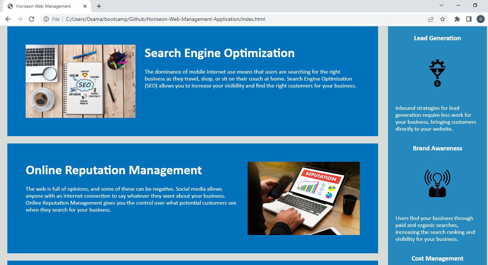

# Horiseon Web Manangement

## Descriptions
This landing page was created for Horiseon Web Management. The code was refactored so that the website meets the accessibility standards.

## URL
https://oriarh.github.io/Horiseon-Web-Management-Application/

## Screenshot

## Installation

N/A

## Usage

When you open this web app, you can see some important elements of web management and how they impact the business. These are the services that Horiseon Web Management offers. 
The topics are divided into different sections and each sections contains descriptions of each tool or service.

This web app was built using HTML and CSS. 

## Credits

UC Berkeley Extension Instructional Staff

## License

MIT License

## Features

Meets Accesibility Standards.
The elements follow a logical structure independent of styling and positioning.
